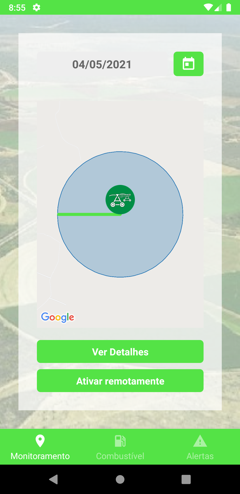
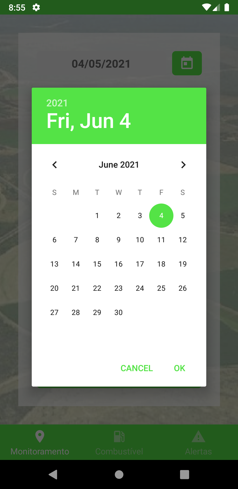
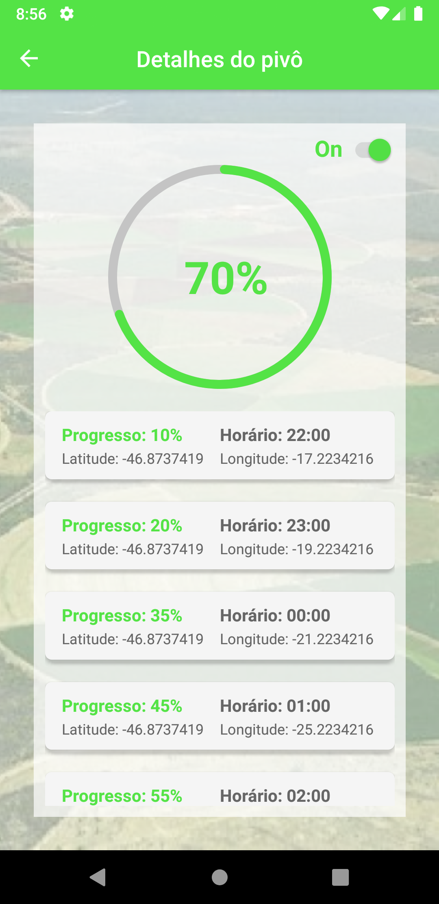
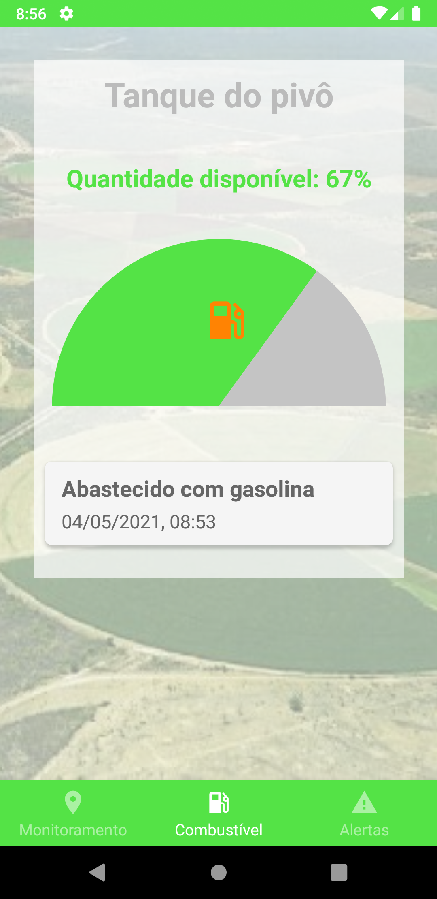
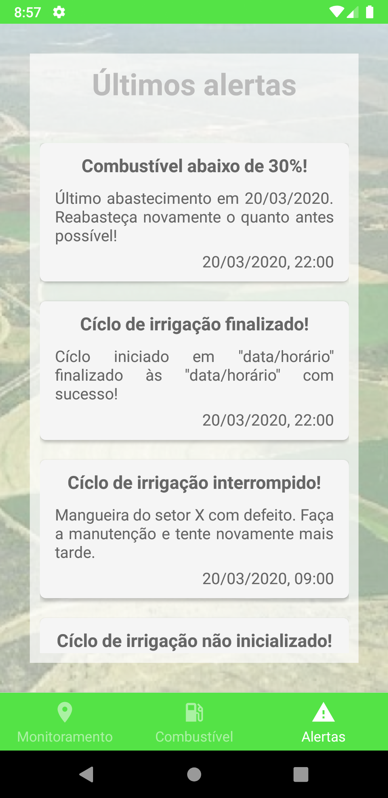

# Introduction

This is a pivo app developed with [react-native](https://reactnative.dev/) and initially focused on android.

## Requirements

It needs proper installation of react-native with [android studio](https://developer.android.com/studio). Try using java version 8 but feel free to try another one, just don't forget to change android core files and fix gradle issues too.

You also need a Maps SDK for Android. Follow this [guide](https://developers.google.com/maps/documentation/android-sdk/overview) if you are not familiar with the process.

## Installation

Clone or download the files from the repository and run `yarn` (or `npm install`) to install dependencies. Then run the `android` and `start` scripts to install and launch your app on the device. The `start` script just starts the Metro bundler.

## Screenshots

